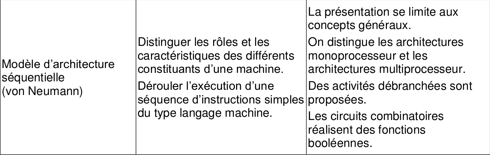
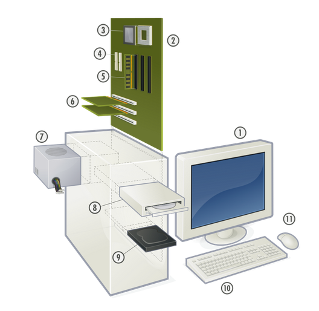
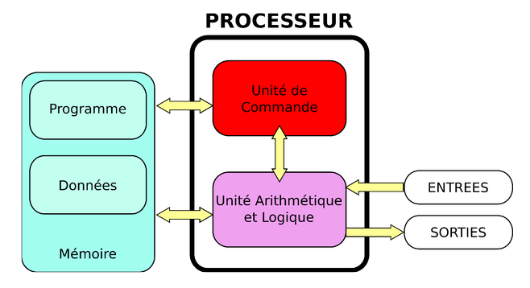
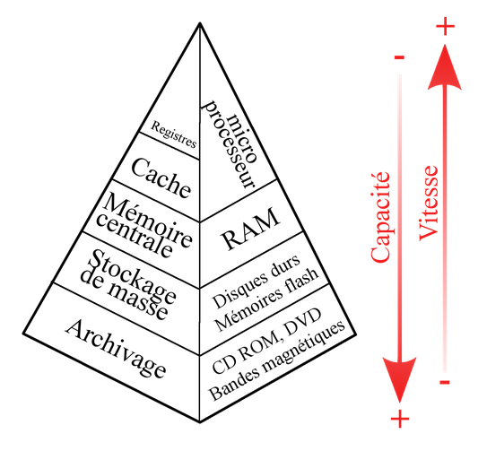

# CH1 : Constituants et périphériques d'une machine

??? note "Programme officiel"
	

## 1. Les constituants d'une machine
### 1.1 Démonter un ordinateur

<iframe width="560" height="315" src="https://www.youtube.com/embed/Fk2kYo2E61A" title="YouTube video player" frameborder="0" allow="accelerometer; autoplay; clipboard-write; encrypted-media; gyroscope; picture-in-picture" allowfullscreen></iframe>

### 1.2 Constituants et périphériques d'un ordinateur
Le **micro-ordinateur** est traditionnellement composé d’une **unité centrale** (unité de traitement de l’information), essentiellement un **microprocesseur**, ainsi que d’**interfaces d’entrée** (clavier, souris, etc.) et d’**interfaces de sortie** (écran, imprimante, etc…).

Les éléments présents sur l'image ci-dessus sont :

1. L’**écran** : affiche les informations (texte, image, vidéo, …)
2. La **carte mère** : regroupe les principaux circuits de l’ordinateur
3. Le **microprocesseur** : exécute les instructions des programmes
4. Les **connecteurs** pour périphériques (disques durs, …)
5. La **mémoire vive** (RAM) : stocke momentanément les données et les programmes
6. Les **cartes d’extension** : ajoutent des fonctionnalités à l’ordinateur (ports, TV, vidéo, …)
7. L’**alimentation** : fournit aux divers composants une énergie électrique régulée
8. Le(s) **lecteur(s)/graveurs(s) optique(s)** : CD, DVD, …
9. Le(s) **disque(s) dur(s)** : stocke de façon durable les données et les programmes
10. Le **clavier** : permet la saisie de caractères, …
11. La **souris** : permet le pointage d’éléments sur l’écran

## 2. Le modèle d'architecture de Von Neumann
### 2.1 Un peu d'histoire
[Vidéo du cours Lumni](http://www.lumni.fr/video/une-histoire-de-l-architecture-des-ordinateurs)

### 2.2 L'architecture de Von Neumann
On étudiera en fin d'année le fonctionnement de cette architecture. Mais pour l'instant on va retenir que les éléments essentiels d'un ordinateur sont :

- l’**unité arithmétique et logique** ( UAL)  ou unité de traitement : elle effectue tous les calculs que peut réaliser le microprocesseur.
- l’**unité de contrôle**  : elle effectue le « séquençage des opérations » en envoyant les ordres à l’UAL
- la **mémoire** : elle contient à la fois les données et les programmes.
- les **dispositifs d’entrées-sorties** : ils permettent de communiquer avec l’extérieur.

### 2.3 C'est quoi le microprocesseur (CPU) ?
Il est constitué de 3 parties :
 
- L’**unité arithmétique et logique**
- L’**unité de commande**
- Les **registres**, qui permettent de mémoriser de l’information temporairement.

### 2.4 La mémoire
La mémoire permet de stocker des données et des programmes, elle se divise entre :

- **mémoire volatile** (programmes et données en cours de fonctionnement, effacés lorsque l’alimentation est coupée)
- **mémoire permanente** (programmes et données de base de la machine)

Différents types de mémoire sont utilisés dans un ordinateur :

### 2.5 Les bus
Le système permettant la circulation des données entre les parties de l’ordinateur est appelé **bus**.

Il existe 3 grands types de bus :

- Le **bus d’adresses** permet de faire circuler des adresses.
- Le **bus de données** permet de faire circuler des données. 
- Le **bus de contrôle** permet de spécifier le type d’action.
