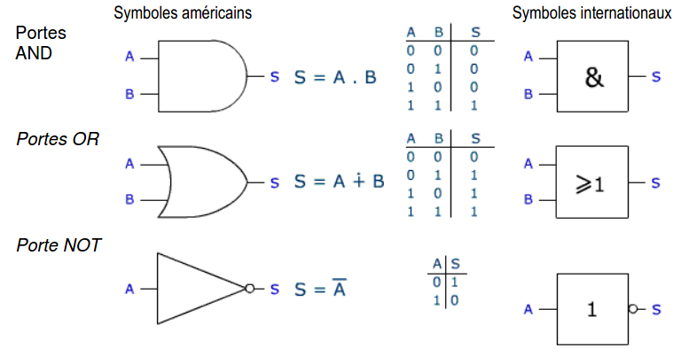
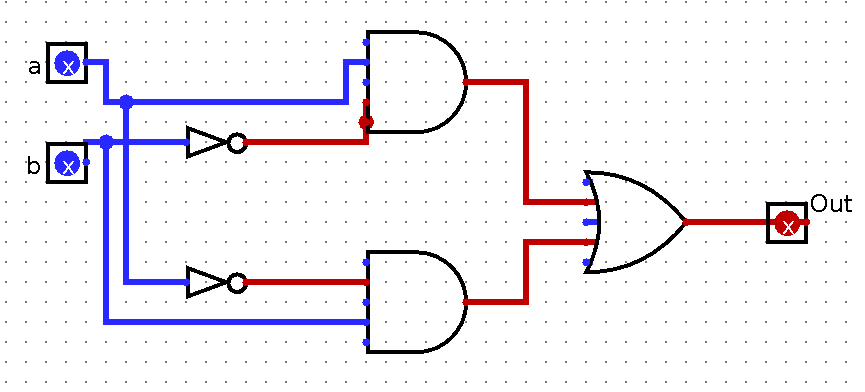

# CH2 : Les opérateurs booléens

??? note "Programme officiel"
	

## 1. Le calcul booléen
### 1.1 Un peu d'histoire
{: .center}

En 1847, le britannique **George BOOLE** inventa un formalisme permettant d'écrire des raisonnements logiques : l'**algèbre de Boole**. La notion même d'informatique n'existait pas à l'époque, même si les calculs étaient déjà automatisés (penser à la Pascaline de 1642).

Bien plus tard, en 1938, les travaux de l'américain **Claude SHANNON** prouva que des circuits électriques peuvent résoudre tous les problèmes que l'algèbre de Boole peut elle-même résoudre. Pendant la deuxième guerre mondiale, les travaux d'**Alan TURING** puis de **John VON NEUMANN** poseront définitivement les bases de l'informatique moderne.

### 1.2 Variable booléenne
!!! savoir "À savoir"
	**Une variable booléenne** est une variable qui ne peut prendre que deux valeurs possibles :
	
	- Vrai (`True` :snake:) ou 1
	- Faux (`False` :snake:) ou 0

	Une variable booléenne en Python est du type `bool`.

    ```python
	>>> a = False
	>>> print(type(a))
	<class 'bool'>
	```

Remarque : Ouvert/Fermé (interrupteur), Allumé/Éteint (lampe), 5V/0V (tension), Blanc/Noir (pixels d'une image noir et blanc) ... sont également des variables booléennes.

### 1.3 Opérateurs booléens

- Un **opérateur booléen** est un opérateur mathématique qui manipule des variables booléennes.
- Une **expression booléenne** est une expression dont le résultat est un booléen.
- Un **opérande** est un élément sur lequel on applique un opérateur booléen.

#### a. L'opérateur **not**
!!! savoir "À connaître"
	L'opérateur **`not`** ("non" :fr:) est l'opérateur de négation : si on note a la variable d'entrée, not a ou $\mathrm{\overline{a}}$ renvoie la négation de a.
	
	Table de vérité de `not`

	| a | not a |
	|:-:|:-:|
	| 0 | 1 |
	| 1 | 0 |

!!! python "En python"
	```python
	>>> a = True
	>>> print(not a)
	False
	>>> b = not a
	>>> print(not b)
	True
	```

#### b. L'opérateur **and**
!!! savoir "À connaître"
	L'opérateur **`and`** ("et" :fr:) est un opérateur de **conjonction**. Si a et b sont deux variables booléennes, `a and b` renvoie **Vrai** si `a` et `b` sont Vrai toutes les deux, et **Faux** sinon.
	
	La table de vérité de `and`
 

	| a | b | a and b |
	|:-:|:-:|:-:|
	| 0 | 0 | 0 |
 	| 0 | 1 | 0 |
	| 1 | 0 | 0 |
	| 1 | 1 | 1 |

!!! python "En python"
	```python
	>>> a = True
	>>> b = True
	>>> c = False
	>>> print(a and b)
	True
	>>> print(c and b)
	False
	```

#### c. L'opérateur **or**
!!! savoir "À connaître"
	L'opérateur **`or`** ("ou" :fr:) est un opérateur de **disjonction**. Si a et b sont deux variables booléennes, `a or b` renvoie **Vrai** quand au moins un des deux opérandes `a` ou `b` sont Vrai, et **Faux** sinon.
	
	La table de vérité de `or`
 

	| a | b | a or b |
	|:-:|:-:|:-:|
	| 0 | 0 | 0 |
 	| 0 | 1 | 1 |
	| 1 | 0 | 1 |
	| 1 | 1 | 1 |

!!! python "En python"
	```python
	>>> a = True
	>>> b = True
	>>> c = False
	>>> d = False
	>>> print(a or b)
	True
	>>> print(c or b)
	True
	>>> print(d or c)
	False
	```

#### d. L'opérateur **xor**
!!! savoir "À savoir"
	L'opérateur **`xor`** ("ou exclusif" :fr:) est un opérateur de **disjonction exclusive**. Si a et b sont deux variables booléennes, `a xor b` renvoie **Vrai** un seul des deux opérandes `a` ou `b` sont Vrai, et **Faux** sinon.
	
	La table de vérité de `xor`
 

	| a | b | a xor b |
	|:-:|:-:|:-:|
	| 0 | 0 | 0 |
 	| 0 | 1 | 1 |
	| 1 | 0 | 1 |
	| 1 | 1 | 0 |


### 1.4 Évaluation d'une expression booléenne
!!! savoir "À connaître"
	Il faut faire comme en mathématique. On doit tenir compte de la priorité des opérations et des parenthèses. Le `not` est prioritaire devant `and` qui lui-même est prioritaire devant `or` ou `xor`.

#### Expression comportant uniquement des valeurs booléennes
Exemple : A = `True and True or (not False and False)`

On commence par la parenthèse ( `not False` devient `True` puis `True and False` devient `False` : A = `True and True or (True and False)` = `True and True or False`

Puis `and` est prioritaire devant `or` (donc `True and True` devient `True`): A = `True or False`

On a enfin A = `True`

#### Expression comportant des variables booléennes
Pour évaluer l'expression, on peut établir une **table de vérité**. Il faut faire la table de vérité de chaque partie de l'expression en tenant compte des règles précédentes.

Exemple de l'expression `a or not b` :

| a | b | not b | a or not b |
|:-:|:-:|:-:|:-:|
| 0 | 0 |     1 |          1 |
| 0 | 1 |     0 |          0 |
| 1 | 0 |     1 |          1 |
| 1 | 1 |     0 |          1 |

### 1.5 Les expressions booléennes et python
#### Les opérateurs booléens
##### Remarque 1 : 
Les opérateurs booléens sont `not`, `and` et `or`.

Ne pas confondre avec les opérateurs de comparaison qui renvoient une valeur booléenne.

```python
>>> 4 // 2 == 3
False
>>> (7 > 3) and (9 != 8) and not False
True
```

Dans ces deux exemples `==`, `>`, `!=` sont des opérateurs de comparaison qui renvoient un booléen.

##### Remarque 2 :
Python pratique l'**évaluation paresseuse** (short-circuit evaluation :gb:). L'évaluation paresseuse le fait que l'interpréteur Python s'arrête dès que sa décision est prise.

Exemple :

```python
>>> (20 // 2 == 8) and (20 // 4 == 5)
False
```

Comme le premier booléen vaut `False` et que la conjonction `and` est appelée, il n'est pas nécessaire d'évaluer le deuxième booléen.

Essayez de lancer dans le terminal ci-dessous : `False and print("Salut")` et comparez le à `True and print("Salut")`. Comparez ensuite avec l'opérateur `or`.

{{ terminal() }}


## 2. De l'expression booléenne au composant électronique
### 2.1 Un peu d'histoire
Les circuits d’un ordinateur manipulent uniquement des **0** ou des **1** représentés en interne par des **tensions hautes ou basses**. Les premiers ordinateurs construits dans la période 1945-1950 sont basés sur une technologie de **tube à vide ou tube électrique**.

En 1947, aux laboratoires Bell, Shockley, Bardeen et Brattain inventent le **transistor**, un petit composant électronique qui se comporte comme un interrupteur. Les transistors, plus petits et dissipant moins de chaleur, vont supplanter les tubes électriques. En 1954 le germanium est remplacé par le silicium, en 1955 apparaissent les premiers ordinateurs entièrement transistorisés. En 1960 le transistor à effet de champ permet l’intégration de dizaines composants dans un centimètre carré. Les transistors sont ensuite directement gravés dans une plaque de silicium constituant un **cicrcuit intégré**.

En 1965, **Gordon Moore** futur directeur d’Intel énonce la loi empirique suivante : il y aura doublement de la densité d’intégration des transistors tous les deux ans. Cette loi s’est vérifiée jusqu’à présent avec une finesse de gravure d’environ 5 nanomètres en 2020. Le graphique ci-dessous représente l’évolution du nombre de transistors par circuit intégré.

{: .center}

## 2.2 Les portes logiques
Dans un ordinateur, les opérations de calcul sont effectuées en binaire, à l'aide de **portes logiques**. En associant des transistors, on réalise ces portes logiques. Une porte logique est un circuit électronique représentant une fonction logique.

Voici ci-dessous la représentation de quelques portes (représentation américaine et internationnale)

{: .center}

## 2.3 Circuit combinatoire
Un **circuit logique combinatoire** permet de réaliser une ou plusieurs fonctions booléennes : ses sorties ne dépendent que de l'état actuel de ses entrées. Les portes logiques NOT, NOR, NAND, AND, OR et XOR sont des circuits combinatoires.

!!! exercice "Exemple"
	=== "Que fait ce circuit ?"
		Déterminer la fonction logique réaliser par ce circuit.

		

	=== "Aide : Simuler en ligne"
		Réaliser des circuits logiques et les tester [ici](https://dept-info.labri.fr/ENSEIGNEMENT/archi/circuits/blank-teacher.html)

	=== "Solution"
		On a réalisé une porte `xor`.

		Vous pouvez vérifier que `(a and not b) or (not a and b) = a xor b`

Il existe d'autres circuits, dits **séquentiels**, dont les sorties se calculent non seulement à partir de leurs valeurs d’entrée actuelles mais aussi à partir de leurs états précédents : le facteur temps intervient. Ils utilisent des circuits de mémoire pour mémoriser leurs états antérieurs.
